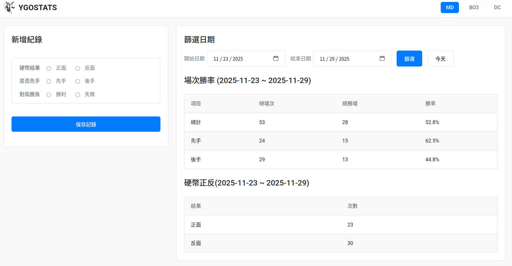

## Prerequirement

Install [NodeJS](https://nodejs.org/en/download)


## Installation

```bash
pnpm install
npx node-gyp rebuild --directory=node_modules/better-sqlite3
```


## Build

```bash
pnpm build
```

## Execution

```bash
NODE_ENV=production PORT=12345 HOST="127.0.0.1" ORIGIN="http://127.0.0.1:12345" node build/index.js
```


## Screenshot


